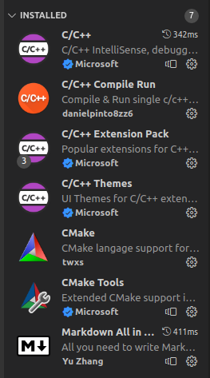

# UP210063_CPP

REPOSITORY 

## Welcome to my REPOSITORY 

Welcome to my repository im a developer-student to differents parts of software i like HTML, CSS & JAVASCRIPT obiously i try to upgrade my knows to this tecnologies. 

Now i learn the lenguages of programming to C++ in the 	IDE 

# VISUAL STUDIO CODE

   
# How to install visual studio code in a terminal linux (ubuntu)? 
 
## Step 1
    First you push the keycaps on your keybord in this sequence 
    "Ctrl+Alt+T" (to open the terminal)
 ## Step 2    
    After then you introduce the next code in terminal 
    " sudo snap install --classic code "
## Step 3 
    Wait to finish the install the visual studio code in your device and enjoy your new IDE 
    

# What visual extensions do I use to program in C++?

 
In this IDE there are different types of extensions that people used to programming in C++ in this case I upload my extensions
you can use different extensions if you like other

    
<a href=" #https://marketplace.visualstudio.com/items?itemName=ms-vscode.cpptools"> ➤ Results and Discussion</a>

 

# MAIN STRUCTURE 

### In this page i will upload the files that I do in the programming subject on the unit 1 to unit 4

> 1. Unit 1 " Programming introduction "
> 2. Unit 2 " Control structures and cycles "
> 3. Unit 3 " Functions "
> 4. Unit 4 " Files and arrays "

## If you have a suggestion let me know !!

# what is c++ ?
