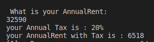

<div align = "center">

# EXCERSICE 1.- RENTA PROGRAM IN C++

<div>

<div align= "justify">

## What is the purpose of this program? well, the program was made with a simple instruction

## This instruction is:
    The tax brackets for the declaration of income
    in a given country are the following:

    Tax rate income
    Less than $10,000 5%
    Between $10,000 and $20,000 15%
    Between $20,000 and $35,000 20%
    Between $35,000 and $60,000 30%
    More than $60,000 45%

    Write a program that asks the user for their rent
    annual and shows on the screen the tax rate that
    corresponds

<div>

<div align = "center">

# INPUT
<div>

<div align = "justify">

```c++
                        // introduce the rent account 
    cout << " What is your AnnualRent: " << endl;
    cin >> AnnualRent;
    
```
<div>

<div align = "center">

# PROCCESS
<div>

<div align = "justify">

```c++
                // the variables are validated by the functions 
    if (AnnualRent < 10000)
    {
        Tax =.05;
    }
    else if (AnnualRent >= 10000 & AnnualRent <20000 )
    {
        Tax = .15;
    }
    else if (AnnualRent >= 20000 & AnnualRent <35000)
    {
        Tax = .20;
    }
    else if (AnnualRent >= 35000 & AnnualRent < 60000)
    {
        Tax = .30;
    }
    else if (AnnualRent >= 60000 )
    {
        Tax = .45;
    }
    
```

<div>

<div align = "center" >

# OUTPUT 
<div>


<div align = "justify">

```c++    
                    // you can see the results in this part 
    cout << "your Annual Tax is : " << (Tax*100) << "%" << endl;
    cout << "your AnnualRent with Tax is : " << (AnnualRent*Tax) << endl;

```
<div>

<div align = "center">

## EXPLANATION
<div>

<div align = "justify ">

>1. Ask the user for his annual rent.

>2. Check that the user entered a valid rent.   
>2.1 If the user does not enter a valid rent, print a message that the  user entered an incorrect number.  
>2.2 If the user entered a valid rent, continue with the program.

>3.  Check by several if's which tax rate.  
>3.1 If the rent is less than $10, 000 it is 5% (.05).  
>3.2 If the rent is greater than or equal to $10,000 and less than $20,000 it is 15% (.15).  
>3.3 If the rent is greater or equal to $20,000 and less than $35,000, it is 20% (.20).   
>3.4 If the rent is greater or equal to $35,000 and less than $60,000 it is 30% (.30).  
>3.5 If the rent is greater than $60,000 it is 45% (.45). 

>4. Multiply the rent by the tax rate.

>5. Print the tax rate and its equivalent in dollars. 

<div>

<div align = "center" >

# Texts
<div>

<div align = "justify">

### A) Rent < $10,000


### B) Rent >= $10,000 and Rent < $20,000 


### C) Rent >= $20,000 and Rent < $35,000 


### D) Rent >= $60,000

<div>