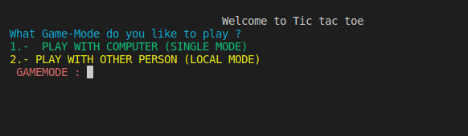
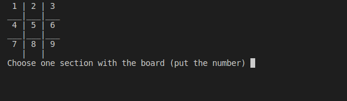
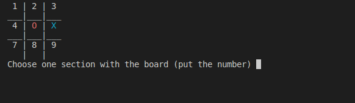
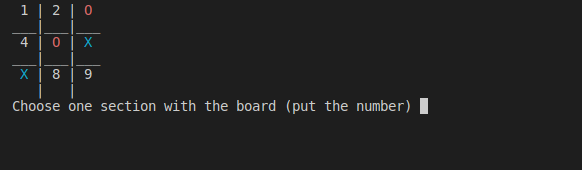
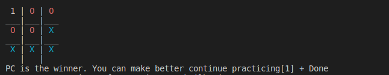

# TIC_TAC_TOE

    What part of the readme would you like to see?

>1.- [INTRODUCTION](#introduction)

>2.- [FLOWCHART](#flowchart) 

>3.- [DEVELOPMENT & EXPLANATION OF A CODE EXECUTION](#development-and-explanation-of-code-execution)

>4.- [TIC TAC TOE](#test-tic-tac-toe)

>5.- [ADVANTAGE](#advantage)

>6.- [LIMITATIONS](#limitations)

>7.- [END_OF_README](#conclusion)

___________________

## INTRODUCTION 

    
## WHAT IS THE PURPOSE FOR THIS PROJECT?

    The main purpose for this project was to be able to 
    improve our ability to develop code in the c++ 
    language using function prototyping to be able to use 
    them in other functions within this same code.

 
    
    The c++ language is very extensive and thanks               
    to that we can do many things with this language. 
    In this particular case we were with a matrix 
    which would serve as our game board. In the first 
    instance, the board needed to be divided by arrangements 
    in the form of " | " and " _ " 

[BACK TO TIC TAC TOE](#TIC_TAC_TOE)

_______

## FLOWCHART

    
-  ## WHAT IS THE PURPOSE TO FLOWCHART

                    A Flow Diagram is the representation and graphic 
                    schematization of an algorithm, 
                    which graphs the steps and processes to follow
                    to reach the solution of a problem that you
                    want to solve.

                    Its correct construction is extremely important 
                    since from the same diagram the program was
                    written in some Programming Language in this 
                    case it was c++ (BUT YOU CAN USE OTHER 
                    LANGUAGE PROGAMMING )and the problem was the game 
                    of the cat (TIC TAC TOE)  

[BACK TO TIC TAC TOE](#TIC_TAC_TOE)

___________________

## DEVELOPMENT AND EXPLANATION OF CODE EXECUTION 

    
## EXPLANATION OF A CODE EXECUTION 
 
    HOW CAN YOU PLAY A TIC TAC TOE?

<h2> WINDOWS</h2> 

## STEP 1.-
    Clone this repo with the following command in your terminal:
    "git clone https://github.com/Up210063/UP210063_CPP.git"
## STEP 2.-

    Download and install the compiler in this link:
    https://sourceforge.net/projects/mingw/files/OldFiles/ 

## STEP 3.-
    Open the terminal at the direction of the file with the command:
    cd C:\Documents\...

## HOW COMPILE 
    To compile use command:
    gcc  02_JuegoGato.cpp or 02_JuegoGato.exe

## HOW RUN
     To run type this code:
     02_JuegoGato.exe

<h2> Linux (Ubuntu)</h2>

## STEP 1.-
   
    Download or clone my repo with the following command in the terminal:
    "git clone https://github.com/Up210063/UP210063_CPP.git"

## STEP 2.-
    
    Install GNU c/c++ compiler, open the terminal and type:
    
    1.-$ sudo apt-get update
    2.-$ sudo apt-get install build-essential manpages-dev

## HOW COMPILE 

    To compile this program you shuould type the comand:
    gcc 02_JuegoGato.c or 02_JuegoGato

## HOW RUN 
    To run this program you should type:
    ./02_JuegoGato 

## MY OPINION (NOT IMPORTANT)

    LINUX IS MORE SENSE TO COMPILE & EXECUTER THE PROGRAMS IN C++
    YOU HAVE TO WATCH HOW EASY IS COMPILE & EXECUTER IN THIS SYSTEM OPERATIVE IN COMPARATION TO WINDOWS  

[BACK TO TIC TAC TOE](#TIC_TAC_TOE)

___________________

## TEST TIC TAC TOE 

    
## MAIN THING'S TO CONSIDER IN THIS CASE 
>1.- Dont write numbers with  a decimal point or letters when calling for playing.

>2.- In multiplayer, player 1 is "O" and player 2 is "X".

>3.-In single player mode, the player is "O" and the PC is "X".

---------------------

## WHO PLAY THE GAME?

## STEP 1 .-
    Choose the GAMEMODE to play and select with number 1 (green ) or number 2 (yellow)

## STEP 2 .- 

    you have to select a number in the board to try to win the match and complete your purpose in this game

## STEP 3 .-

    in this case I select the number 5 in the board and the machine selected the number 6 

## STEP 4 .-

    Then I select the number 3 in the board and the machine selected the number 7

## WINNER 

    But in this case i put in the number 2 and the computer put in the 8 for complete the match i put in the number 4 but i forgot the number 9 and this is the history to how i lost to a PC machine in tic tac toe :(  

[BACK TO TIC TAC TOE](#TIC_TAC_TOE)

_______

## ADVANTAGE 

    
## MY ADVANTAGE FOR THIS PROJECT

>1.- improve my knowledge in C++ language

>2.- improve my use with functions so as not to clutter the main

>3.-improve my writing

[BACK TO TIC TAC TOE](#TIC_TAC_TOE)

______________

## LIMITATIONS 

    
## MY LIMITATIONS FOR  THIS PROJECT

>1.- At first it was hard for me to know how to use functions

>2.- I had to support myself with my partner

>3.- I kept trying to understand the use of ternaries to simplify if and else

[BACK TO TIC TAC TOE](#TIC_TAC_TOE)

______________

## END_OF_README  

    
## CONCLUSION

    In conclusion, I can say that this project was a very complex challenge for me since I had never done this type of exercise, normally I thought that C++ was used to create things like programs to take averages, menus or things like that, but now I realize that can be used for more things, now all that remains is to practice and make mistakes since mistakes make perfect.
- ### “'Si lo puedes imaginar, lo puedes programar'" -(Alejandro Miguel Taboada)

[BACK TO TIC TAC TOE](#TIC_TAC_TOE)

