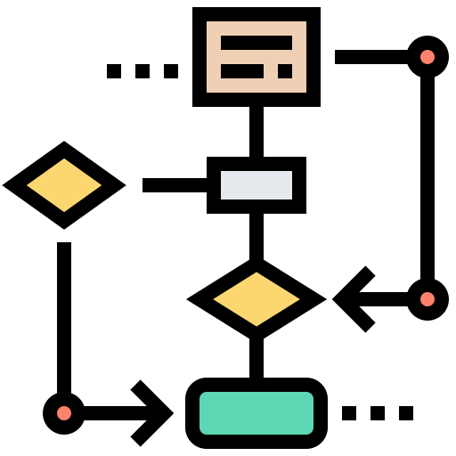
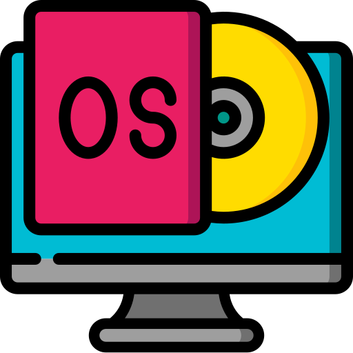

# TIC_TAC_TOE

    What part of the readme would you like to see?

>1.- [INTRODUCTION](#introduction)

>2.- [FLOWCHART](#flowchart) 

>3.- [DEVELOPMENT & EXPLANATION OF A CODE EXECUTION](#development-and-explanation-of-a-code-execution)

>4.- [ADVANTAGE](#advantage)

>5.- [LIMITATIONS](#limitations)

>6.- [END_OF_README](#conclusion)

___________________

## INTRODUCTION 

    
## WHAT IS THE PURPOSE FOR THIS PROJECT?
    The main purpose for this project was to be able to 
    improve our ability to develop code in the c++ 
    language using function prototyping to be able to use 
    them in other functions within this same code.

    

    The c++ language is very extensive and thanks               
    to that we can do many things with this language. 
    In this particular case we were with a matrix 
    which would serve as our game board. In the first 
    instance, the board needed to be divided by arrangements 
    in the form of " | " and " _ " 

[BACK TO TIC TAC TOE](#TIC_TAC_TOE)

_______

## FLOWCHART

    
-  ## WHAT IS THE PURPOSE TO FLOWCHART

[BACK TO TIC TAC TOE](#TIC_TAC_TOE)

___________________

## DEVELOPMENT AND EXPLANATION OF CODE EXECUTION 

    
## EXPLANATION OF A CODE EXECUTION 
 
    HOW CAN YOU PLAY A TIC TAC TOE?

<h2> WINDOWS</h2> 

## STEP 1.-
    Clone this repo with the following command in your terminal:
    "git clone https://github.com/Up210063/UP210063_CPP.git"
## STEP 2.-

    Download and install the compiler in this link:
    https://sourceforge.net/projects/mingw/files/OldFiles/ 

## STEP 3.-
    Open the terminal at the direction of the file with the command:
    cd C:\Documents\...

## HOW COMPILE 
    To compile use command:
    gcc  02_JuegoGato.cpp or 02_JuegoGato.exe

## HOW RUN
     To run type this code:
     02_JuegoGato.exe

<h2> Linux (Ubuntu)</h2>

## STEP 1.-
   
    Download or clone my repo with the following command in the terminal:
    "git clone https://github.com/Up210063/UP210063_CPP.git"

## STEP 2.-
    
    Install GNU c/c++ compiler, open the terminal and type:
    
    1.-$ sudo apt-get update
    2.-$ sudo apt-get install build-essential manpages-dev

## HOW COMPILE 

    To compile this program you shuould type the comand:
    gcc 02_JuegoGato.c or 02_JuegoGato

## HOW RUN 
    To run this program you should type:
    ./02_JuegoGato 

## MY OPINION (NOT IMPORTANT)

    LINUX IS MORE SENSE TO COMPILE & EXECUTER THE PROGRAMS IN C++
    YOU HAVE TO WATCH HOW EASY IS COMPILE & EXECUTER IN THIS SYSTEM OPERATIVE IN COMPARATION TO WINDOWS  

[BACK TO TIC TAC TOE](#TIC_TAC_TOE)

___________________

## ADVANTAGE 

    
## MY ADVANTAGE FOR THIS PROJECT

>1.-

>2.-

>3.-

>4.-

[BACK TO TIC TAC TOE](#TIC_TAC_TOE)

______________

## LIMITATIONS 

    
## MY LIMITATIONS FOR  THIS PROJECT

>1.-

>2.-

>3.-

>4.-

[BACK TO TIC TAC TOE](#TIC_TAC_TOE)

______________

## END_OF_README  

    
## CONCLUSION
    lorem aoshdfk ja
    
    
-    -  “'Si lo puedes imaginar, lo puedes programar'" -(Alejandro Miguel Taboada) 

[BACK TO TIC TAC TOE](#TIC_TAC_TOE)

